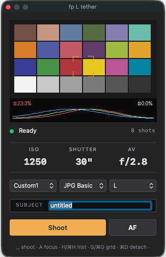
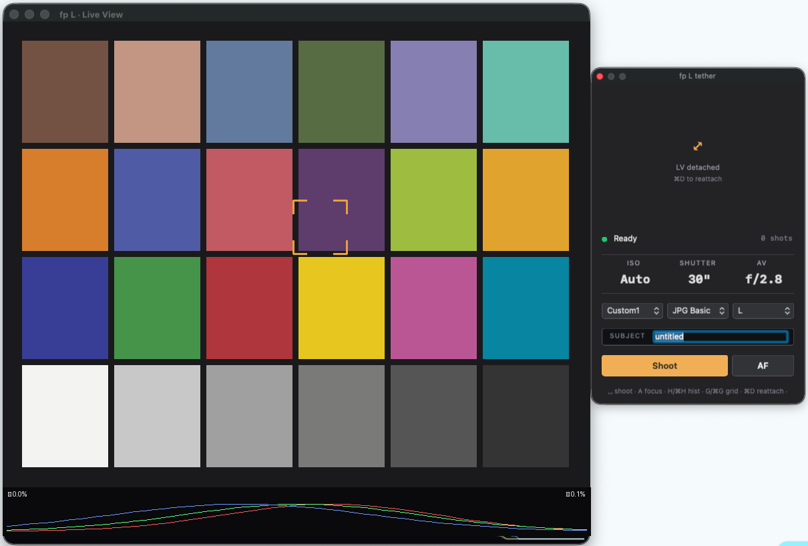

# fp-l-tether

> **An open-source Python tether implementation for the Sigma fp L on macOS, with Lightroom Classic auto-import.**
> Sigma fp L のテザー撮影を macOS で動かすオープンソース Python 実装 — Lightroom Classic 連携対応。

[]()
[]()
[](LICENSE)
[]()

---

## What it does

`fp-l-tether` is a self-contained tethering daemon + floating control panel
for the Sigma fp L on macOS. The headline features:

- **Live View** at up to 10 fps, with click-to-AF
- **Detachable LV window** (⌘D) — pop Live View out of the panel into a
  resizable 3:2 window for art-repro / studio work
- **RGB histogram overlay** (H / ⌘H) on Live View with highlight / shadow
  clipping markers
- **Composition grid overlay** (G / ⌘G) — cycle thirds / golden ratio /
  10×6 alignment grid
- **Floating control panel** that follows you across macOS Spaces and
  Lightroom fullscreen
- **Lightroom Classic Auto Import** integration — every shot lands in your
  catalog automatically
- **Auto USB recovery** — when the fp L's bulk endpoint wedges (a known
  firmware quirk), this daemon detects the wedge and force-re-enumerates
  the device via IOKit in ~4 seconds. No physical power cycle needed.
- **Persistent settings cache** — your ISO / SS / Aperture / WB / Format
  and LV window state stay remembered across disconnects and recoveries.
- **JPG / DNG / DNG+JPG** capture with dual-file extraction
- **Exposure controls** — ISO, SS, Aperture, WB, Format, Resolution
  via floating panel dropdowns
- **質実剛健 UI** — anodized-black + amber accent + SF Mono hero values,
  inspired by the Sigma fp's industrial design

Status: feature-complete and used daily by the author for studio
product photography. Bug reports and pull requests very welcome.

---

## Screenshots

### Floating control panel



The compact panel sits above Lightroom Classic and across macOS Spaces.
Live View at the top with click-to-AF reticle and an RGB histogram strip
(highlight / shadow clipping percentages at the corners). Hero exposure
values (ISO, Shutter, Aperture) in SF Mono, plus dropdowns for format,
resolution, and white balance. Spacebar shoots; `A` focuses; `H`/`G`
toggle the overlays.

> Live View shown here is a Macbeth ColorChecker placeholder — the real
> Live View renders camera frames at 10 fps.

### Detachable Live View window



`⌘D` pops Live View into a resizable 3:2 window for art-repro / studio
work. Click-to-AF, RGB histogram, and composition grid all stay alive
in the detached window. The compact panel shrinks to expose exposure
controls only, with a clear placeholder showing the LV is detached.

---

## Why this project

The Sigma fp L is a remarkable little camera that deserves a great
tethered shooting experience. This is a community-built option for
photographers who want their fp L shots to land directly in Lightroom
Classic and who enjoy customizing their tools.

---

## Quick start

### Install

```bash
git clone https://github.com/iochan-ship-it/fp-l-tether.git
cd fp-l-tether
python3 -m venv venv
source venv/bin/activate
pip install -e .
```

### Connect the camera

1. Power **OFF** the fp L
2. CINE/STILL switch → **STILL**
3. Power **ON**
4. MENU → System → **USB mode → Camera Control**
5. Power **OFF**, plug USB-C into Mac, power **ON**

### Run

```bash
# Kill macOS's built-in PTP daemon first (claims the camera exclusively).
sudo killall ptpcamerad

# Launch the daemon + floating panel.
sudo venv/bin/fp-l-tether start
```

`sudo` is required because libusb has to detach the kernel driver from
the camera's PTP interface. See `docs/SETUP.md` for an explanation of
the permission model.

### Lightroom integration

The daemon writes each shot atomically into a watch folder. Point
Lightroom Classic's **File → Auto Import → Auto Import Settings…** at
that folder and your shots will appear in your catalog on save. See
`docs/LIGHTROOM.md` for full setup.

---

## What's working / not working

| Feature | Status |
|---|---|
| Capture (single shot, PC-triggered) | ✅ Works |
| Capture (camera-button-triggered) | ❌ The fp L locks body controls while in Camera Control USB mode |
| Live View (10 fps) | ✅ Works |
| Click-to-AF on Live View | ✅ Works |
| ISO / SS / Av / WB / Format / Resolution control | ✅ Works |
| Lightroom Auto Import | ✅ Works |
| Auto USB recovery from wedge | ✅ Works (~4 s) |
| Settings preservation across reconnects | ✅ Works |
| Burst / continuous capture | ⚠️ Single shot only (mode=2). Continuous on roadmap. |
| Video / movie tether | ❌ Not supported, no plans |
| Linux / Windows | ❌ macOS only (IOKit-dependent recovery path) |

---

## Project structure

```
fp_l_tether/                 # Python package
  camera/
    ptp_codes.py             # PTP opcodes + dataclasses + wire parsers
    usb_bridge.py            # libusb PTP transport + capture/download
    sigma_datagroup.py       # DataGroup IFD parser + exposure decode
    usb_recovery.py          # IOKit USBDeviceReEnumerate driver
    settings_preservation.py # Snapshot/restore user-dialed settings
    ic_bridge.py             # ImageCaptureCore enumeration (limited)
  transfer/
    watcher.py               # TetherDaemon main loop
    liveview.py              # Live View stream
    heartbeat.py             # USB keep-alive
    atomic.py                # Atomic write helper
  lightroom/
    destinations.py          # Watch folder / session folder router
  ui/
    cli.py                   # Typer CLI (start / shoot / status / inspect)
    floating_panel.py        # PyObjC NSPanel with LV + AF overlay
  storage/
    settings_cache.py        # Persistent settings cache
  telemetry/
    logger.py                # structlog wrappers
  config/
    __init__.py              # Pydantic-validated TOML config

scripts/                     # Diagnostic & verification scripts
  phase3_usb_reenum_test.py  # Standalone USB recovery verifier
  phase3_liveview_*.py       # Live View diagnostics

docs/
  SETUP.md                   # macOS setup, libusb, ptpcamerad notes
  LIGHTROOM.md               # Lightroom Classic Auto Import setup
  TROUBLESHOOTING.md         # Common issues

tests/unit/                  # pytest tests (no camera needed)
config.example.toml          # Example config; copy to config.toml to override defaults
```

---

## Requirements

- macOS 12 (Monterey) or later (tested on macOS 26 Apple Silicon)
- Python 3.10+
- [Homebrew](https://brew.sh) + `libusb`: `brew install libusb`
  (or rely on the bundled `libusb-package` wheel)
- Sigma fp L in **Camera Control** USB mode
- USB-C cable, directly to Mac (avoid hubs)
- `sudo` for libusb kernel driver detach
- Adobe Lightroom Classic (optional, for the Auto Import workflow)

---

## How it works (high level)

The daemon runs three coordinated threads sharing a single libusb bulk
endpoint:

1. **Main loop** — polls `GetCaptureStatus(slot=N)` where `N` is the
   camera's `image_db_head`, drains the snap/AF/exposure request queues,
   and downloads completed shots via `GetBigPartialPictFile`.
2. **Live View thread** — at 10 fps grabs JPEG view frames via
   `GetCamViewFrame` (0x902b), pauses across snaps/AF, has its own
   exponential backoff for `0x2019 DeviceBusy` storms.
3. **Heartbeat thread** — every 30 s sends a benign keep-alive opcode
   (default: `sigma_get_camera_info`).

When any of those threads sees the fp L's bulk endpoint wedge
(`Errno 60` / 0-byte read — a known firmware doze quirk), the main loop
tears down the session and calls
`IOUSBDeviceInterface::USBDeviceReEnumerate()` via IOKit, which forces
the macOS USB host controller to drop and re-enumerate the device.
Equivalent to physically unplugging and replugging the cable, but
software-driven. A new bridge is opened, the persistent settings cache
is replayed to the camera, and Live View resumes within ~4 s.

Settings preservation works the same way: on every (re)connect, the
daemon reads the user's last-known good values from
`~/.fp-l-tether/user_settings.json` and writes them to DG1 + DG2 via
the per-field `SetCamDataGroup1/2` opcodes. Updates to the cache happen
whenever the user changes a setting from the floating panel.

See `fp_l_tether/transfer/watcher.py` for the full state machine.

---

## Contributing

This is a personal project but PRs and issues are welcome — especially
from other fp / fp L owners. Some things that would be particularly
helpful:

- USB packet captures of Sigma camera traffic that document Live View
  or AF behaviour, especially anything that exercises keep-alive
  patterns not visible in the public PTP opcode set.
- fp / fp L L-mount lens correction tables (currently no lens correction
  is applied in either JPG or DNG; the camera handles JPG correction
  internally).
- Linux port. The recovery path uses macOS IOKit, but the PTP layer is
  portable. A `libusb_reset_device()` substitute on Linux should
  produce similar wedge recovery.
- Burst / continuous shooting (mode=6 START_CAPTURE).

---

## Acknowledgements

This work would not have been possible without:

- **libgphoto2** (LGPL-2.1+) — as a reference for the PTP wire protocol
  details that are common across cameras. The `cameras/sigma-fp.txt`
  capture trace contributed by Sigma fp owners to libgphoto2 was an
  invaluable reference for understanding which Sigma vendor opcodes
  shape DataGroup writes during init. See `NOTICE` for full attribution.
- **sigma-ptpy** by makanikai — an independent Python implementation of
  the Sigma PTP protocol that we cross-referenced our observations
  against.
- All the fp / fp L owners who posted USB captures and protocol notes
  on GitHub issues, Reddit r/SigmaFP, and DPReview over the years.

---

## License

This project is released under the [MIT License](LICENSE).
See `NOTICE` for third-party attribution.

"SIGMA", "Sigma fp", and "Sigma fp L" are trademarks of SIGMA Corporation.
This project is **not affiliated with, endorsed by, or sponsored by SIGMA
Corporation**. The PTP wire-format details documented here were obtained
through clean-room observation of public USB traffic against a Sigma
fp L, in line with the interoperability provisions of 17 U.S.C. § 1201(f)
and EU Directive 2009/24/EC Article 6.
